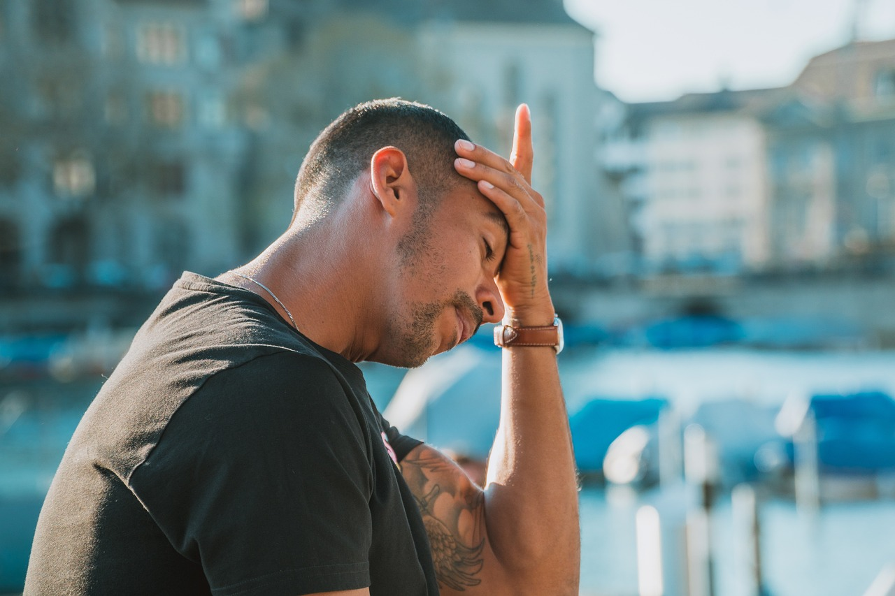

Stress sucks. It really does. And there’s no way to completely remove it from your life, at least not permanently. It’s a fact of life. There are things you can do to manage it, though.

Avoid alcohol. Get lots of sleep. Maintain a good diet and for the love of god, go for a walk and pick up a weight a couple of times a week. It’s not magic. It’s just the way our bodies work.

Treat your body well, and you’ll feel good. Treat it badly, and you’ll find the stress will find ya.

I didn’t learn the value of regular exercise until I was 26, so the first few years out of college were pretty stressful. I had no money, no job, and a degree in a field completely unrelated to the jobs I was pursuing. It wasn’t easy those first couple of years. Luckily, I had family to fall back on, which is a privilege not everyone shares.

I can remember when I got my first full-time job. It wasn’t for very much money, but it was something. It would give me the experience I needed to further my career. A lot of stress came with this role. Again, pre-consistent exercise and my diet wasn’t terrific either.

My manager had too much on their plate. They micromanaged. I dealt with it poorly. I didn’t have the tools in my toolbox nor the base of health to help me manage it. I bit a lot of nails and shed a few tears in those days. I also turned to alcohol when things got stressful. It happens. Alcohol is one of those things that relieves in the moment, but you pay for it later—usually the following day. It’s a depressant, after all, so that relief comes at a price.

Anyways, years later, a lot of life experience and a better base of health, and I find the stress a little more manageable. Again, it never goes away completely. It ebbs and flows and sometimes you let one of those pillars of stress defense slip. Things get tough again. You remember why it is you do the things you do and you build that pillar back up.

Other things I’ve found helpful, while not quite on the same level as sleep, diet, and exercise are avoiding negativity in social media and the endless scroll. I don’t know what it is exactly about mindless consumption of social media, but it always leaves me feeling a little down. I cut out Instagram, Facebook, Snapchat, and the host of other platforms out there. I’m on Reddit and YouTube occasionally, but I could stand to cut back on those as well. It helps.

I also think being honest and open with others about the mental challenges you’re facing, while difficult, tends to make things a bit better too. Usually, I get a “yeah, me too, I’m feeling the same way” when it comes to expressing my feelings of stress and fatigue. Especially now in this economic climate, we’re all feeling the pressure.

But yeah, return to the basics if ya can. Diet. Exercise. Sleep. No alcohol. If those things are in place, you’ll probably start feeling a bit better. Easier said than done, I know. Maybe start with one.

Also, take breaks. Step away from the screen for a little bit. Even if you’re in a leadership position and people depend on you. What I’ve found is that 10-15 minutes, hell make it 30 minutes to yourself, and no one’s going to die. Folks can figure things out with you away. Build systems and cultures that allow you to step away from the keyboard and mouse for a moment. Those little red slack bubbles are asynchronous, remember? You can answer them when you get around to it.

Just remember, if you overextend yourself, you’re not doing anyone any favors. Great things are built when you’re at your best. Subpar or average products are built when you try to always go go go. Smell the flowers for a moment.
