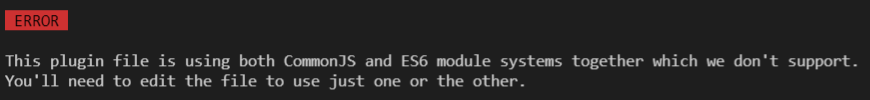

While working with [Gatsby 4](https://www.gatsbyjs.com/) today, I noticed that the syntax for importing code from external libraries differed between the files [gatsby-node.js](https://www.gatsbyjs.com/docs/reference/config-files/gatsby-node/) and [gatsby-browser.js](https://www.gatsbyjs.com/docs/reference/config-files/gatsby-browser/). In the `-node.js` file, it imported code using `require()`, while in the `-browser.js` file it imported code using the keywords `import` and `from`. Why is that?

## What is a module?

First we must ask ourselves, what is a `module`? A module is simply isolated code that can be exported from one file and imported to another. As modern web applications evolved and grew in size, the need for modules became essential in order to split our code out, share, consume, and reuse code in an easy-manner, and avoid possible naming collisions.

## CommonJS vs. ES6 Modules

It may at first not be abundantly clear that these two javascript files are actually running in different environments-- one is on the server, and the other is in the web browser. The syntactical sugar for exporting code and importing code from one file to another differs depending on where your code is running. On the server, Node supports modules by using CommonJS and does not currently support ES6 module syntax, without using something like [Babel](https://babeljs.io/) to transpile your code. On the browser, however, ES6 modules are on the table!

CommonJS:

```js
const path = require(`path`)
const { createFilePath } = require(`gatsby-source-filesystem`)

exports.createPages = async ({ graphql, actions, reporter }) => {
  const { createPage } = actions
  // ...
```

ES6:

```js
import { onRouteUpdate } from "./gatsby-browser"

onRouteUpdate = ({ location, prevLocation }) => {
  console.log("new pathname", location.pathname)
  console.log("old pathname", prevLocation ? prevLocation.pathname : null)
}
```

## Can you mix the two?

In some instances, you can (like Gatsby version 1), however, it is not recommended. In fact, in Gatsby 4 you'll get errors:

```js
// ES6
import "./src/style.css"

// CommonJS
const React = require("react")
const Layout = require("./src/components/layout")
exports.onRouteUpdate = ({ location, prevLocation }) => {
  console.log("new pathname", location.pathname)
  console.log("old pathname", prevLocation ? prevLocation.pathname : null)
}
```

### Whoops!



### Check out this awesome explanation of CommonJS and ES6 Modules:

Still confusing? This video I found by [Monster Lessons](https://www.youtube.com/watch?v=mK54Cn4ceac) breaks it down really well.
