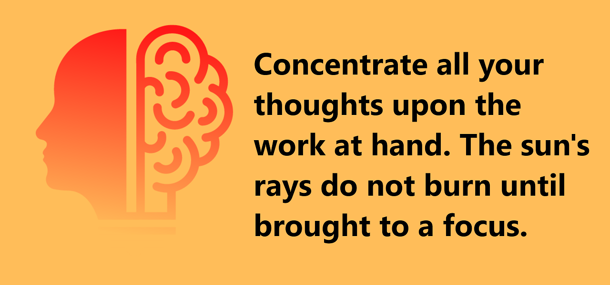

### Technologies used to build extensions

Some HTML, CSS, and Javascript is all it takes to build an extension.

### What is step 1?

Step 1 is setting up a [manifest.json](https://developer.chrome.com/docs/extensions/mv3/intro/mv3-overview/) file. In it, you will specify things like `name`, `description`, app `version`, `manifest_version`, `icons`, and components you will be using.

### Service workers

[Service workers](https://developer.chrome.com/docs/extensions/mv3/architecture-overview/#background_script) are a big part of the architecture when building extensions. They replace a concept known as [background pages](https://developer.chrome.com/docs/extensions/mv3/migrating_to_service_workers/). Service workers essentially have access to some api's that other parts of your extension do not. The team at Google created an architecture in this way to prevent a lot of security issues that would arise from development without them.

### Forewarning: The extension documentation is NOT great

The extension documentation is in an "in-between" phase at the moment as manifest version 2 phases out and version 3 phases in. You'll find some pages refer to v2 without any mention that this won't work in v3. Refer to the [migration guide](https://developer.chrome.com/docs/extensions/mv3/mv3-migration-checklist/) before diving too deep to be aware of what will and won't work with the latest version.

### Understand promises

A lot of the methods return a promise for the chrome apis. `chrome.storage` for example returns a promise anytime you set or get information from local storage. The `async/await` pattern is a good thing to brush up on if you want to work with promises in an easy way. Here is an [in-depth explanation](https://developer.chrome.com/docs/extensions/mv3/promises/) with some examples of how to use promises.

### Getting your app in a ready-to-review state takes longer than expected

There's a lot of prep that goes into launching an extension. You need a privacy policy, you need a developer account ($5), you need to take some screen shots of your app, you need to specify your "single-use", why you use certain permissions, etc. It's not as easy as dropping your zipped-up code somewhere. It's NOT hard, just a bit tedious. Here is a [guide](https://developer.chrome.com/docs/webstore/publish/) on how to publish.

### Privacy policy

You're going to need a privacy policy, especially if you're collecting and handling personal or sensitive user data. What does "handle" mean? Refer to this [legal-jargon-filled document](https://developer.chrome.com/docs/webstore/user_data/). I found a [privacy policy generator](https://www.privacypolicygenerator.info/) online that can help spit one out. I'm not taking payments or collecting sensitive info so I did not scrutinize every single detail of the generated template, but you may have to.

### Need a bare bones build tool?

Try [esbuild](https://esbuild.github.io/) if you just need something simple to minify and bundle your project. It's so easy to get it up and running, I much prefer it to something like webpack. Also, Google says to NOT obfuscate your code FYI.

### Security, Security, Security

Do you know what can cause a [XSS](https://developer.mozilla.org/en-US/docs/Glossary/Cross-site_scripting) attack? How about what a [Content Security Policy](https://developer.mozilla.org/en-US/docs/Web/HTTP/CSP) is? [Cross-origin resource sharing](https://developer.mozilla.org/en-US/docs/Web/HTTP/CORS)? Brush up on these terms and review the extension development [best-practices](https://developer.chrome.com/docs/extensions/mv3/security/).

### How did I make my logo?

[Canva](https://www.canva.com/)! It costs (at the time of this post) $12.99 per month and you can cancel anytime. I love how easy it is to use and how many options I have to make a logo look really, really good.

### Conclusion

I hope some of this knowledge helps you build your own extension! Good luck.
