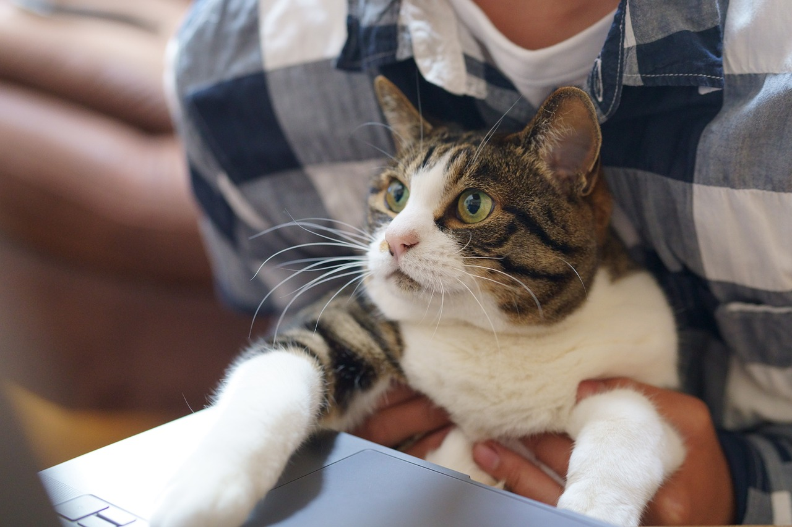

Last week, news broke that Google is [considering attendance as a part of employee performance](https://www.wsj.com/articles/google-gets-stricter-about-employees-time-in-office-9a20f2e), signaling another push from a tech giant to bring employees back into the office. This decision raises the question: why do companies insist on in-office work? The belief is that employees working in the office will work longer, harder, and be more compliant with managerial demands.

## The Remote vs. In-Office Tug-of-War

Currently, employees and employers find themselves engaged in a tug-of-war over remote work versus in-office work. Each side has its reasons for pulling. Employees have grown fond of remote work, as it eliminates commuting time and provides them with greater control over their schedules. They are reluctant to give up this newfound flexibility. However, [Gallup's research](https://www.gallup.com/workplace/398306/quiet-quitting-real.aspx) reveals the presence of a significant phenomenon known as "Quiet Quitting," where employees disengage and feel disconnected from their organizations while working remotely. On the other hand, employers desire to have their employees back in the office, physically present and visible for monitoring and control.

## Accountability Matters

Ultimately, the issue at hand is accountability. It is possible that employees have taken advantage of the freedoms provided by remote work. However, it is important to remember that remote work is still a professional arrangement where employees are compensated for their time and effort. While there is room for flexibility, there are boundaries that need to be respected. Some employers believe that these boundaries have been crossed.

## Navigating Remote Work Accountability

As an advocate of remote work, I have experienced the benefits of increased time and energy. Nevertheless, I recognize the need for personal accountability throughout the day. If the work becomes less engaging, strategies must be employed to stay on track. For example, opening a virtual meeting room where colleagues can drop in and ask questions or setting self-imposed deadlines and seeking peer support in meeting them. The truth is we all require a degree of accountability to perform at our best. The question becomes whether we can provide this accountability for ourselves or if we need our employers to play a role.

## The Role of Company Culture

It is also worth considering that certain company cultures may be predominantly in-person. For instance, if Elon Musk chooses to run his companies with in-person-only expectations and demanding work hours, that is a choice employees make when joining. However, it is the responsibility of employers to clearly communicate and establish these terms from the beginning.

The ongoing debate between remote and in-office work highlights the importance of accountability and clear expectations. Remote work offers undeniable benefits, but it requires individuals to establish their own structures and mechanisms for accountability. Employers, in turn, must communicate their expectations and create a supportive culture regardless of the work arrangement. By finding the right balance and fostering a culture of accountability, organizations can maximize productivity while also allowing employees to remain free of the burdens of commute times and other strenuous factors.
